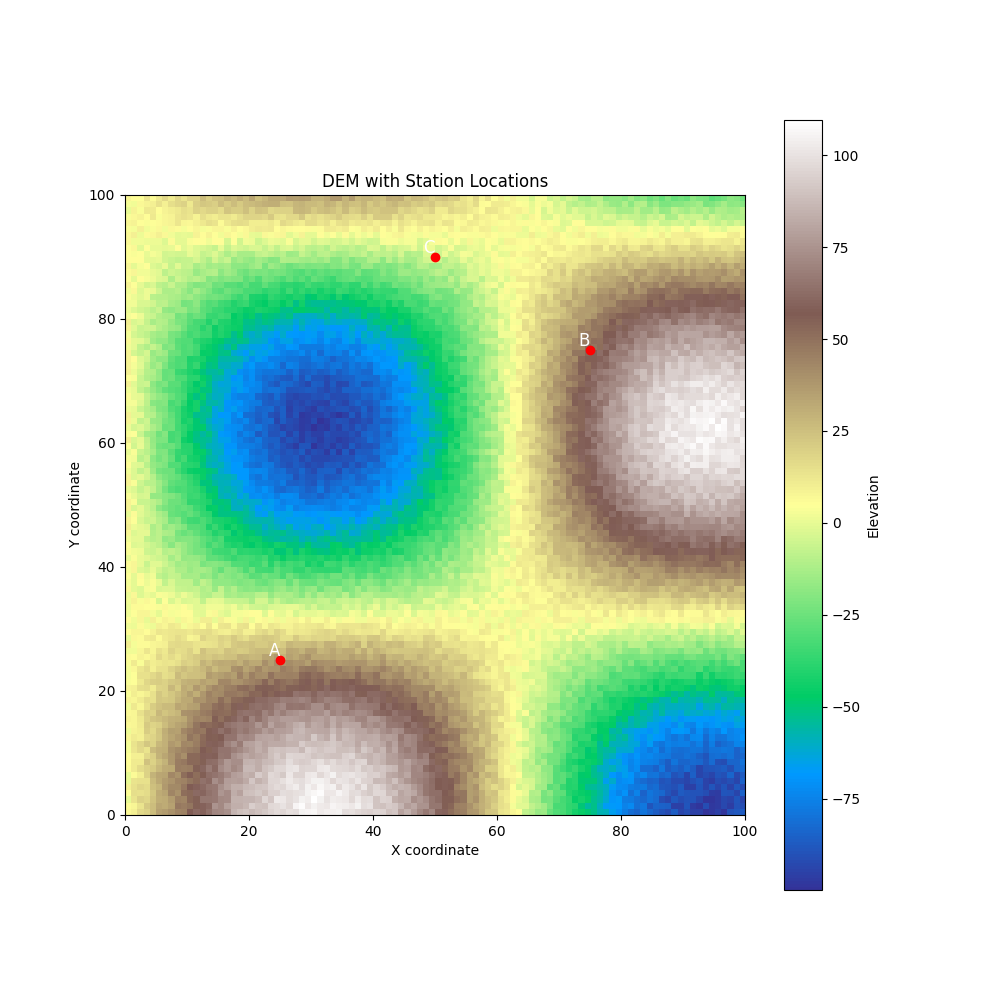
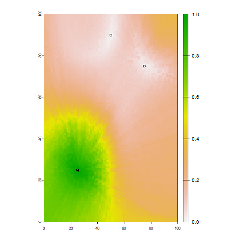

# Comparison of Seismic Analysis Packages: eseis (R) vs pyseis (Python)

This report provides a comprehensive comparison between 11 functions from two seismic analysis packages: eseis for R and pyseis for Python.

<table>
<tr>
<th>eseis (R)</th>
<th>pyseis (Python)</th>
</tr>
<tr>
<td>

### spatial_distance()


</td>
<td>

### spatial_distance()



</td>
</tr>
<tr>
<td>

### spatial_amplitude()



</td>
<td>

### spatial_amplitude()


</td>
</tr>
<tr>
<td>

### spatial_pmax()

Dataset visualization here

</td>
<td>

### spatial_pmax()

Dataset visualization here

</td>
</tr>
<tr>
<td>

### spatial_clip()

Dataset visualization here

</td>
<td>

### spatial_clip()

Dataset visualization here

</td>
</tr>
<tr>
<td>

### spatial_convert()

Uses ggplot2 for high-quality, customizable plots.


</td>
<td>

### spatial_convert()

Utilizes matplotlib for flexible plotting options.


</td>
</tr>
<tr>
<td>

### spatial_migrate()

Generally good spatial_migrate(), especially with vectorized operations in R.

</td>
<td>

### spatial_migrate()

Excellent performance, particularly for large datasets, due to Python's numerical computing libraries.

</td>
</tr>
<tr>
<td>

### model_bedload()

Smaller but active community, primarily in academic geosciences.

</td>
<td>

### model_bedload()

Large and diverse community, with extensive resources and third-party integrations.

</td>
</tr>
<tr>
<td>

### model_turbulance()

Well-documented with comprehensive function descriptions and examples.

</td>
<td>

### model_turbulance()

Extensive documentation, including tutorials, API references, and example galleries.

</td>
</tr>
<tr>
<td>

### fmi_parameters()

Integrates well with other R packages for statistical analysis and machine learning.

</td>
<td>

### fmi_parameters()

Seamlessly integrates with the Python scientific ecosystem (NumPy, SciPy, Pandas, etc.).

</td>
</tr>
<tr>
<td>

### fmi_inversion()

- Specialized functions for environmental seismology
- Built-in datasets for learning and testing

</td>
<td>

### fmi_inversion()

- GPU acceleration for certain operations
- Advanced array processing techniques

</td>
</tr>
<tr>
<td>

### fmi_spectra()

```r
library(eseis)
data(earthquake)
plot(earthquake$signal, type = "l", 
     xlab = "Time", ylab = "Amplitude")
```


</td>
<td>

### fmi_spectra()

```python
import pyseis
import matplotlib.pyplot as plt

data = pyseis.read_example_data()
plt.plot(data.time, data.amplitude)
plt.xlabel("Time")
plt.ylabel("Amplitude")
plt.show()
```


</td>
</tr>
</table>

This comparison highlights the key features and differences between eseis (R) and pyseis (Python) for seismic data analysis. Both packages have their strengths, and the choice between them often depends on the specific requirements of the project and the user's familiarity with R or Python ecosystems.
