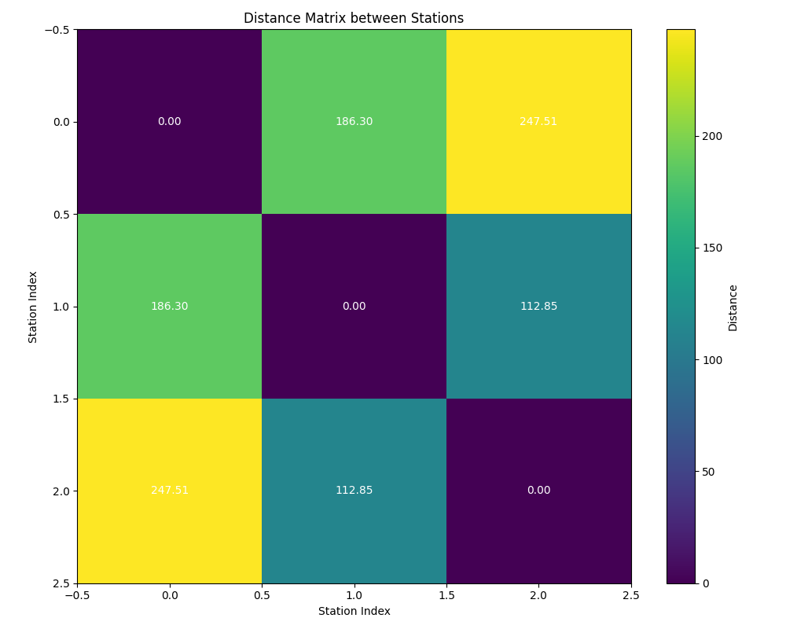
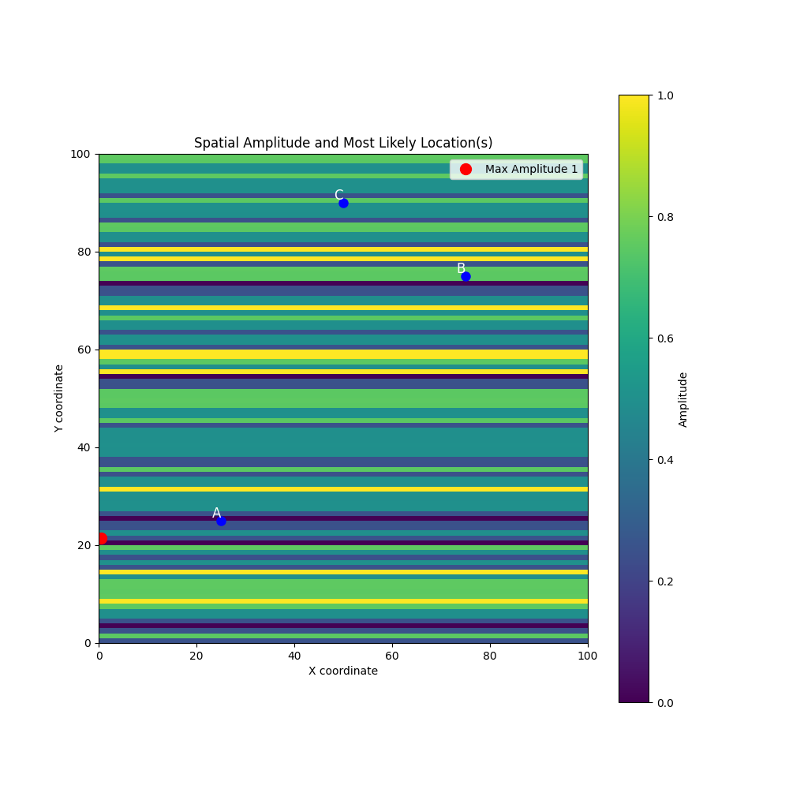
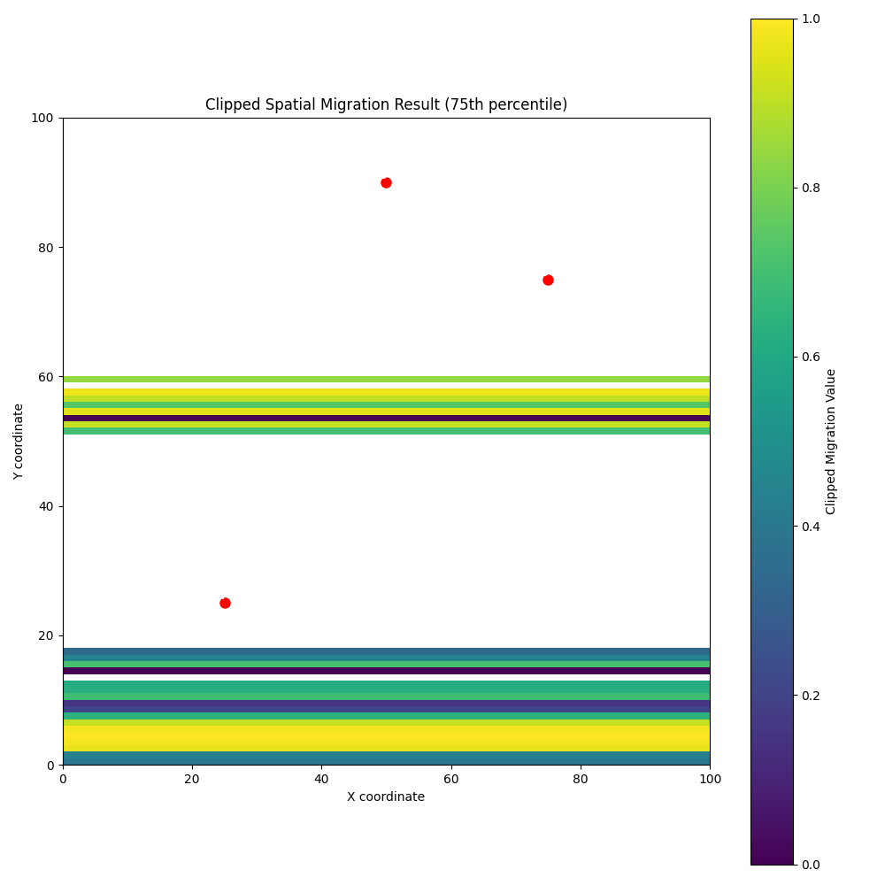
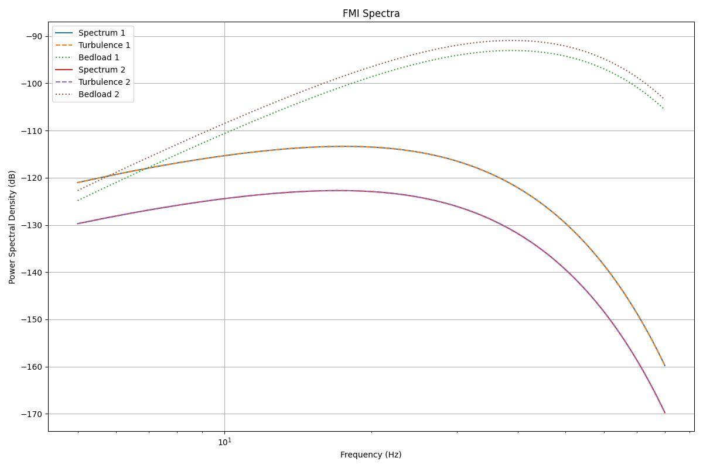
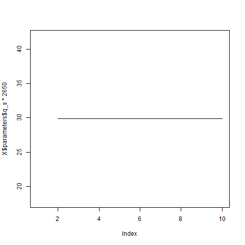
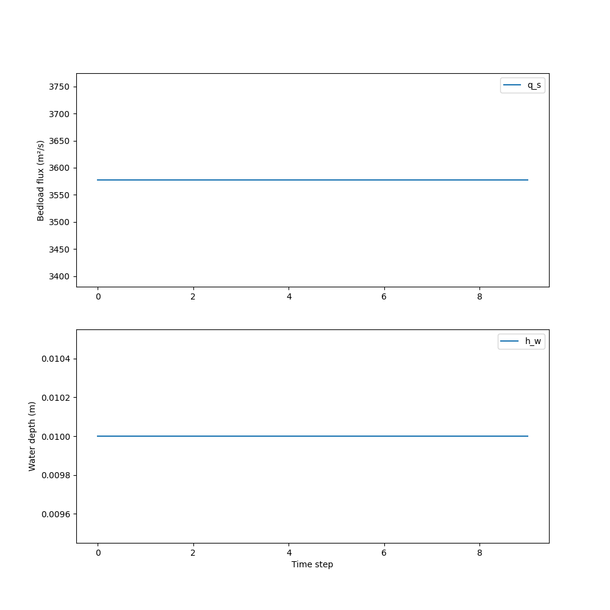

# Comparison of Seismic Analysis Packages: eseis (R) vs pyseis (Python)

This report provides a comprehensive comparison between 11 functions from two seismic analysis packages: eseis for R and pyseis for Python.
Throught the comparison, same input data has been used to test all the modules but there are slight changes due to randomness of the process.

## Functions for spatial data handling

For station A,B and C we tested these following modules:
- `spatial_convert`
- `spatial_distance`
- `spatial_amplitude`
- `spatial_pmax`
- `spatial_migrate`
- `spatial_clip`
  

### eseis (R)

#### The original stations (WGS84 geographic coordinates)

<table border="1" class="dataframe">
  <thead>
    <tr style="text-align: right;">
      <th></th>
      <th>0</th>
      <th>1</th>
      <th>2</th>
    </tr>
  </thead>
  <tbody>
    <tr>
      <th>0</th>
      <td>NaN</td>
      <td>x</td>
      <td>y</td>
    </tr>
    <tr>
      <th>1</th>
      <td>1.0</td>
      <td>25</td>
      <td>25</td>
    </tr>
    <tr>
      <th>2</th>
      <td>2.0</td>
      <td>75</td>
      <td>75</td>
    </tr>
    <tr>
      <th>3</th>
      <td>3.0</td>
      <td>50</td>
      <td>90</td>
    </tr>
  </tbody>
</table>

#### The converted stations (UTM zone 32N) from `spatial_convert`

<table border="1" class="dataframe">
  <thead>
    <tr style="text-align: right;">
      <th></th>
      <th>0</th>
      <th>1</th>
      <th>2</th>
    </tr>
  </thead>
  <tbody>
    <tr>
      <th>0</th>
      <td>NaN</td>
      <td>x</td>
      <td>y</td>
    </tr>
    <tr>
      <th>1</th>
      <td>1.0</td>
      <td>2128199.05236227</td>
      <td>2862732.77717741</td>
    </tr>
    <tr>
      <th>2</th>
      <td>2.0</td>
      <td>2041350.23413185</td>
      <td>9303691.50251585</td>
    </tr>
    <tr>
      <th>3</th>
      <td>3.0</td>
      <td>5e+05</td>
      <td>9997964.943021</td>
    </tr>
  </tbody>
</table>

### pyseis (Python)

#### The original stations (WGS84 geographic coordinates)

<table border="1" class="dataframe">
  <thead>
    <tr style="text-align: right;">
      <th></th>
      <th>0</th>
      <th>1</th>
    </tr>
  </thead>
  <tbody>
    <tr>
      <th>0</th>
      <td>25</td>
      <td>25</td>
    </tr>
    <tr>
      <th>1</th>
      <td>75</td>
      <td>75</td>
    </tr>
    <tr>
      <th>2</th>
      <td>50</td>
      <td>90</td>
    </tr>
  </tbody>
</table>

#### The converted stations (UTM zone 32N) from `spatial_convert`

<table border="1" class="dataframe">
  <thead>
    <tr style="text-align: right;">
      <th></th>
      <th>0</th>
      <th>1</th>
    </tr>
  </thead>
  <tbody>
    <tr>
      <th>0</th>
      <td>2.128199e+06</td>
      <td>2.862733e+06</td>
    </tr>
    <tr>
      <th>1</th>
      <td>2.041350e+06</td>
      <td>9.303692e+06</td>
    </tr>
    <tr>
      <th>2</th>
      <td>5.000000e+05</td>
      <td>9.997965e+06</td>
    </tr>
  </tbody>
</table>

### eseis (R)

#### The Digital Elevation Model with the stations from `spatial_distance`

### pyseis (Python)

#### The Digital Elevation Model with the stations from `spatial_distance`

### eseis (R)

#### This Is the distance matrix of the stations

<table border="1" class="dataframe">
  <thead>
    <tr style="text-align: right;">
      <th></th>
      <th>Unnamed: 0</th>
      <th>1</th>
      <th>2</th>
      <th>3</th>
    </tr>
  </thead>
  <tbody>
    <tr>
      <th>0</th>
      <td>1</td>
      <td>0.000000</td>
      <td>222.117997</td>
      <td>166.651687</td>
    </tr>
    <tr>
      <th>1</th>
      <td>2</td>
      <td>222.117997</td>
      <td>0.000000</td>
      <td>91.692105</td>
    </tr>
    <tr>
      <th>2</th>
      <td>3</td>
      <td>166.651687</td>
      <td>91.692105</td>
      <td>0.000000</td>
    </tr>
  </tbody>
</table>

### pyseis (Python)

#### This Is the distance matrix of the stations

<table border="1" class="dataframe">
  <thead>
    <tr style="text-align: right;">
      <th></th>
      <th>A</th>
      <th>B</th>
      <th>C</th>
    </tr>
  </thead>
  <tbody>
    <tr>
      <th>0</th>
      <td>0.000000</td>
      <td>186.271544</td>
      <td>236.601279</td>
    </tr>
    <tr>
      <th>1</th>
      <td>186.271544</td>
      <td>0.000000</td>
      <td>136.925337</td>
    </tr>
    <tr>
      <th>2</th>
      <td>236.601279</td>
      <td>136.925337</td>
      <td>0.000000</td>
    </tr>
  </tbody>
</table>

#### The plot for distance matrix

### eseis (R)

#### The Most likely location for the signal amplitude from `spatial_amplitude` and `spatial_pmax`

    0       x
    1    25.5
    2    24.5
    Name: 1, dtype: object

#### The plot for the most likely signal

### pyseis (Python)

#### The Most likely location for the signal amplitude from `spatial_amplitude` and `spatial_pmax`

<table border="1" class="dataframe">
  <thead>
    <tr style="text-align: right;">
      <th></th>
      <th>0</th>
      <th>1</th>
    </tr>
  </thead>
  <tbody>
    <tr>
      <th>0</th>
      <td>0.5</td>
      <td>91.5</td>
    </tr>
  </tbody>
</table>

#### The plot for the most likely signal

### eseis (R)

#### The clipped result from `spatial_clip` and `spatial_migrate`

### pyseis (Python)

#### The clipped result from `spatial_clip` after `spatial_migrate`

    
    Clipped migrated data summary:
    Min value: 0.0
    Max value: 1.0
    Mean value: 0.6892159495892944
    

## Functions for Fluival data handling

We tested these following modules:
- `fmi_parameters`
- `fmi_spectra`
- `fmi_inversion`
- `model_bedload`
- `model_turbulance`
  

### eseis (R)

#### The parameters created with `fmi_parameters`

         Parameter        Set 1        Set 2
    0   Unnamed: 0     1.000000   100.000000
    1          d_s     0.010000     0.010000
    2          s_s     1.350000     1.350000
    3          r_s  2650.000000  2650.000000
    4          q_s     0.017234     0.002259
    5          w_w     6.000000     6.000000
    6          a_w     0.007500     0.007500
    7          h_w     0.912263     1.855273
    8        f_min     5.000000     5.000000
    9        f_max    80.000000    80.000000
    10         r_0     6.000000     6.000000
    11         f_0     1.000000     1.000000
    12         q_0    10.000000    10.000000
    13         v_0   350.000000   350.000000
    14         p_0     0.550000     0.550000
    15         e_0     0.090000     0.090000
    16       n_0_a     0.600000     0.600000
    17       n_0_b     0.800000     0.800000
    

### pyseis (Python)

#### The parameters created with `fmi_parameters`

<table border="1" class="dataframe">
  <thead>
    <tr style="text-align: right;">
      <th></th>
      <th>Parameter</th>
      <th>Set 1</th>
      <th>Set 2</th>
    </tr>
  </thead>
  <tbody>
    <tr>
      <th>0</th>
      <td>r_s</td>
      <td>2650.000000</td>
      <td>2650.000000</td>
    </tr>
    <tr>
      <th>1</th>
      <td>a_w</td>
      <td>0.007500</td>
      <td>0.007500</td>
    </tr>
    <tr>
      <th>2</th>
      <td>p_0</td>
      <td>0.550000</td>
      <td>0.550000</td>
    </tr>
    <tr>
      <th>3</th>
      <td>h_w</td>
      <td>1.608711</td>
      <td>1.656022</td>
    </tr>
    <tr>
      <th>4</th>
      <td>w_w</td>
      <td>6.000000</td>
      <td>6.000000</td>
    </tr>
    <tr>
      <th>5</th>
      <td>q_0</td>
      <td>10.000000</td>
      <td>10.000000</td>
    </tr>
    <tr>
      <th>6</th>
      <td>res</td>
      <td>100.000000</td>
      <td>100.000000</td>
    </tr>
    <tr>
      <th>7</th>
      <td>v_0</td>
      <td>350.000000</td>
      <td>350.000000</td>
    </tr>
    <tr>
      <th>8</th>
      <td>s_s</td>
      <td>1.350000</td>
      <td>1.350000</td>
    </tr>
    <tr>
      <th>9</th>
      <td>r_0</td>
      <td>6.000000</td>
      <td>6.000000</td>
    </tr>
    <tr>
      <th>10</th>
      <td>f_0</td>
      <td>1.000000</td>
      <td>1.000000</td>
    </tr>
    <tr>
      <th>11</th>
      <td>f_max</td>
      <td>80.000000</td>
      <td>80.000000</td>
    </tr>
    <tr>
      <th>12</th>
      <td>e_0</td>
      <td>0.090000</td>
      <td>0.090000</td>
    </tr>
    <tr>
      <th>13</th>
      <td>n_0_a</td>
      <td>0.600000</td>
      <td>0.600000</td>
    </tr>
    <tr>
      <th>14</th>
      <td>n_0_b</td>
      <td>0.800000</td>
      <td>0.800000</td>
    </tr>
    <tr>
      <th>15</th>
      <td>f_min</td>
      <td>5.000000</td>
      <td>5.000000</td>
    </tr>
    <tr>
      <th>16</th>
      <td>q_s</td>
      <td>0.018103</td>
      <td>0.010340</td>
    </tr>
    <tr>
      <th>17</th>
      <td>d_s</td>
      <td>0.010000</td>
      <td>0.010000</td>
    </tr>
  </tbody>
</table>

### eseis (R)

#### One out of two spectrum data with the reference parameters by `fmi_spectra`

<table border="1" class="dataframe">
  <thead>
    <tr style="text-align: right;">
      <th></th>
      <th>Frequency</th>
      <th>Power</th>
    </tr>
  </thead>
  <tbody>
    <tr>
      <th>1</th>
      <td>5.000000</td>
      <td>-127.608937</td>
    </tr>
    <tr>
      <th>2</th>
      <td>5.757576</td>
      <td>-126.308045</td>
    </tr>
    <tr>
      <th>3</th>
      <td>6.515152</td>
      <td>-125.246228</td>
    </tr>
    <tr>
      <th>4</th>
      <td>7.272727</td>
      <td>-124.366681</td>
    </tr>
    <tr>
      <th>5</th>
      <td>8.030303</td>
      <td>-123.630592</td>
    </tr>
  </tbody>
</table>

### pyseis (Python)

#### One out of two spectrum data with the reference parameters by `fmi_spectra`

<table border="1" class="dataframe">
  <thead>
    <tr style="text-align: right;">
      <th></th>
      <th>Frequency</th>
      <th>Power</th>
      <th>Turbulence</th>
      <th>Bedload</th>
    </tr>
  </thead>
  <tbody>
    <tr>
      <th>0</th>
      <td>5.000000</td>
      <td>-120.050781</td>
      <td>-120.050781</td>
      <td>-123.656035</td>
    </tr>
    <tr>
      <th>1</th>
      <td>5.757576</td>
      <td>-118.677461</td>
      <td>-118.677461</td>
      <td>-120.654312</td>
    </tr>
    <tr>
      <th>2</th>
      <td>6.515152</td>
      <td>-117.553299</td>
      <td>-117.553299</td>
      <td>-118.064597</td>
    </tr>
    <tr>
      <th>3</th>
      <td>7.272727</td>
      <td>-116.619294</td>
      <td>-116.619294</td>
      <td>-115.795135</td>
    </tr>
    <tr>
      <th>4</th>
      <td>8.030303</td>
      <td>-115.835051</td>
      <td>-115.835051</td>
      <td>-113.781753</td>
    </tr>
  </tbody>
</table>

#### The plot of the spectrum data with the reference parameters by `fmi_spectra`

### eseis (R)

#### The inversion plot from the `fmi_inversion`

### pyseis (Python)

#### The inversion plot from the `fmi_inversion`

***These are some automated analysis of example usage scenario of the same modules of these two packages.
Overview of how these modules handles data and outputs differently.***
